<!-- TOC -->

- [1. jsplumb 中文基础教程](#1-jsplumb-中文基础教程)
  - [1.1. 什么是jsplumb？](#11-什么是jsplumb)
  - [1.2. jsplumb能干什么？](#12-jsplumb能干什么)
  - [1.3. 基本概念](#13-基本概念)
- [2. 基础demos](#2-基础demos)
  - [2.1. 连接两个节点](#21-连接两个节点)
  - [2.2. 可拖动节点](#22-可拖动节点)
  - [2.3. 连接的其他参数](#23-连接的其他参数)
  - [2.4. 设置连接的默认值](#24-设置连接的默认值)
  - [2.5. 给连接加上样式](#25-给连接加上样式)
  - [2.6. 给连接加上箭头](#26-给连接加上箭头)
  - [2.7. 增加一个端点](#27-增加一个端点)
  - [2.8. 拖动创建连接](#28-拖动创建连接)
  - [2.9. 给端点增加样式](#29-给端点增加样式)
  - [2.10. 节点改变尺寸](#210-节点改变尺寸)
  - [2.11. 限制节点拖动区域](#211-限制节点拖动区域)
  - [2.12. 节点网格对齐](#212-节点网格对齐)
  - [2.13. 给连接添加点击事件：点击删除连线](#213-给连接添加点击事件点击删除连线)
  - [2.14. 删除节点，包括节点相关的连接](#214-删除节点包括节点相关的连接)
  - [2.15. 通过编码连接endPoint](#215-通过编码连接endpoint)
  - [2.16. 连接前的检查，判断是否建立连接](#216-连接前的检查判断是否建立连接)
  - [2.17. 一个端点如何拖拽出多条连线](#217-一个端点如何拖拽出多条连线)
  - [2.18. 整个节点作为source或者target](#218-整个节点作为source或者target)
  - [2.19. 节点缩放](#219-节点缩放)
- [3. jsPlumb事件列表](#3-jsplumb事件列表)
  - [3.1. 常用事件](#31-常用事件)
    - [3.1.1. connection 连接建立时触发](#311-connection-连接建立时触发)
    - [3.1.2. connectionDetached 连接断开时触发](#312-connectiondetached-连接断开时触发)
    - [3.1.3. connectionMoved 连接移动事件](#313-connectionmoved-连接移动事件)
    - [3.1.4. connectionAborted 连接取消事件](#314-connectionaborted-连接取消事件)
    - [3.1.5. click 连接点击事件](#315-click-连接点击事件)
    - [3.1.6. dblclick 连接双击事件](#316-dblclick-连接双击事件)
    - [3.1.7. connectionDrag 连接拖动事件](#317-connectiondrag-连接拖动事件)
    - [3.1.8. connectionDragStop 连接停止拖动事件](#318-connectiondragstop-连接停止拖动事件)
    - [3.1.9. endpointClick 端点单击事件](#319-endpointclick-端点单击事件)
    - [3.1.10. endpointDblClick 端点双击事件](#3110-endpointdblclick-端点双击事件)
    - [3.1.11. contextmenu 鼠标右键事件](#3111-contextmenu-鼠标右键事件)
    - [3.1.12. beforeDrop 连接建立前事件](#3112-beforedrop-连接建立前事件)
    - [3.1.13. beforeDetach 连接断开前事件](#3113-beforedetach-连接断开前事件)
    - [3.1.14. zoom 缩放事件](#3114-zoom-缩放事件)
  - [3.2. 其他事件](#32-其他事件)
    - [3.2.1. Connection Events](#321-connection-events)
    - [3.2.2. Endpoint Events](#322-endpoint-events)
    - [3.2.3. Overlay Events](#323-overlay-events)
- [4. jsPlumb默认配置简介](#4-jsplumb默认配置简介)
- [5. 有没有稍微复杂一点，带有拖放的栗子？](#5-有没有稍微复杂一点带有拖放的栗子)
- [6. 还有哪些类似的图形连线可视化项目](#6-还有哪些类似的图形连线可视化项目)
  - [6.1. G6 AntV](#61-g6-antv)
  - [6.2. VivaGraphJS](#62-vivagraphjs)
  - [6.3. springy](#63-springy)
  - [6.4. graphviz](#64-graphviz)
  - [6.5. visjs](#65-visjs)
- [7. 参考资源](#7-参考资源)

<!-- /TOC -->

# 1. jsplumb 中文基础教程

后续更新会在仓库：https://github.com/wangduanduan/jsplumb-chinese-tutorial.git

> 阅读建议：由于本教程目录太多，建议安装谷歌浏览器插件[Smart TOC](https://chrome.google.com/webstore/detail/smart-toc/lifgeihcfpkmmlfjbailfpfhbahhibba)，方便目录按照目录跳转查看。

## 1.1. 什么是jsplumb？
你有没有想过在你的网站上展示图表或者甚至在浏览器应用程序中使用它？用jsPlumb你可以！它是完全免费的，并根据MIT许可证提供。您可以直接从jsPlumb github网站下载框架。

该项目主要由Simon Porritt开发，他在澳大利亚西德尼担任网络开发人员。 jsPlumb由他积极开发。作为许多优秀的开发人员，他似乎更喜欢开发代码而不是编写教程，这就是为什么我提供一个简单的入门教程。

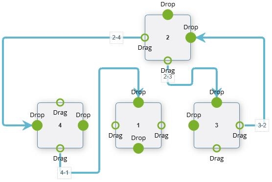


## 1.2. jsplumb能干什么？

那么如果你应该使用它取决于你想用jsPlumb做什么。该框架适用于必须绘制图表的Web应用程序，例如类似于Visio的应用程序或工作流程设计器等。由于图表项目和连接的所有参数都是非常精细可控的，因此您可以绘制您可以想到的任何类型的图表的！

## 1.3. 基本概念

- Souce 源节点
- Target 目标节点
- Anchor 锚点
- Endpoint 端点
- Connector 连接

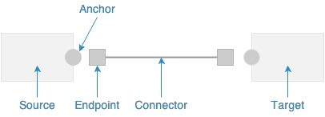


# 2. 基础demos

## 2.1. 连接两个节点

demo: https://wdd.js.org/jsplumb-chinese-tutorial/demos/01.html

jsPlumb.ready方法和jquery的ready方法差不多的功能，jsPlumb.connect用于建立连线

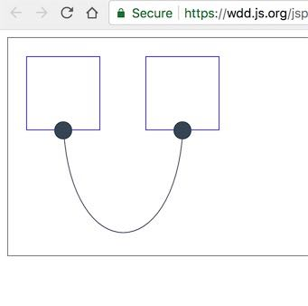


```
<div id="diagramContainer">
    <div id="item_left" class="item"></div>
    <div id="item_right" class="item" style="margin-left:50px;"></div>
  </div>
  <script src="https://cdn.bootcss.com/jsPlumb/2.6.8/js/jsplumb.min.js"></script>

  <script>
    /* global jsPlumb */
    jsPlumb.ready(function () {
      jsPlumb.connect({
        source: 'item_left',
        target: 'item_right',
        endpoint: 'Dot'
      })
    })
  </script>
```


参数说明：
jsPlumb.connect(config) return connection

参数 | 参数类型 | 是否必须 | 说明
---|---|---|---
source | String,Object,Endpoint | 是 | 连线源的标识，可以是id, element, 或者Endpoint
target | String,Object,Endpoint | 是 | 连线目标的标识，可以是id, element, 或者Endpoint
endpoint | String | 可选 | 端点类型，形状

[>>> connect方法详情](https://jsplumbtoolkit.com/community/apidocs/classes/jsPlumbInstance.html#method_connect)


## 2.2. 可拖动节点

demo: https://wdd.js.org/jsplumb-chinese-tutorial/demos/02.html

使用draggable可以让节点被拖动，[draggable方法参考](https://jsplumbtoolkit.com/community/apidocs/classes/jsPlumbInstance.html#method_draggable)

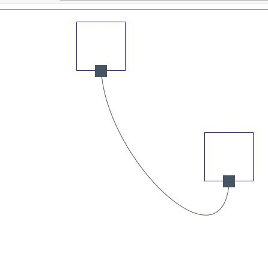

```
<div id="diagramContainer">
    <div id="item_left" class="item"></div>
    <div id="item_right" class="item" style="left:150px;"></div>
  </div>
  <script src="https://cdn.bootcss.com/jsPlumb/2.6.8/js/jsplumb.min.js"></script>

  <script>
    /* global jsPlumb */
    jsPlumb.ready(function () {
      jsPlumb.connect({
        source: 'item_left',
        target: 'item_right',
        endpoint: 'Rectangle'
      })

      jsPlumb.draggable('item_left')
      jsPlumb.draggable('item_right')
    })
  </script>
```


## 2.3. 连接的其他参数

demo: https://wdd.js.org/jsplumb-chinese-tutorial/demos/03.html

可以通过connector去设置连接线的形状，如直线或者曲线之类的。anchor可以去设置锚点的位置。

jsplumb连线的样式有四种

- `Bezier`: 贝塞尔曲线
- `Flowchart`: 具有90度转折点的流程线
- `StateMachine`: 状态机
- `Straight`: 直线

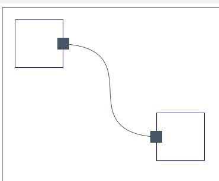

```
<div id="diagramContainer">
    <div id="item_left" class="item"></div>
    <div id="item_right" class="item" style="left:150px;"></div>
  </div>
  <script src="https://cdn.bootcss.com/jsPlumb/2.6.8/js/jsplumb.min.js"></script>

  <script>
    /* global jsPlumb */
    jsPlumb.ready(function () {
      jsPlumb.connect({
        source: 'item_left',
        target: 'item_right',
        endpoint: 'Rectangle',
        connector: ['Bezier'],
        anchor: ['Left', 'Right']
      })

      jsPlumb.draggable('item_left')
      jsPlumb.draggable('item_right')
    })
  </script>
```

## 2.4. 设置连接的默认值

demo: https://wdd.js.org/jsplumb-chinese-tutorial/demos/04.html 

很多连线都是相同设置的情况下，可以将配置抽离出来，作为一个单独的变量，作为connect的第二个参数传入。实际上connect的第二个参数会和第一个参数merge，作为一个整体。

```
<script>
    /* global jsPlumb */
    jsPlumb.ready(function () {
      var common = {
        endpoint: 'Rectangle',
        connector: ['Bezier'],
        anchor: ['Left', 'Right']
      }

      jsPlumb.connect({
        source: 'item_left',
        target: 'item_right'
      }, common)

      jsPlumb.draggable('item_left')
      jsPlumb.draggable('item_right')
    })
  </script>
```

## 2.5. 给连接加上样式

demo: https://wdd.js.org/jsplumb-chinese-tutorial/demos/05.html

例如给连线设置不同的颜色，设置不同的粗细之类的。

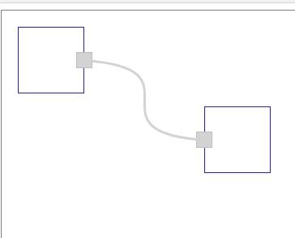

```
jsPlumb.connect({
  source: 'item_left',
  target: 'item_right',
  paintStyle: { stroke: 'lightgray', strokeWidth: 3 },
  endpointStyle: { fill: 'lightgray', outlineStroke: 'darkgray', outlineWidth: 2 }
}, common)
```

## 2.6. 给连接加上箭头

demo: https://wdd.js.org/jsplumb-chinese-tutorial/demos/06.html

箭头实际上是通过设置`overlays`去设置的，可以设置箭头的长宽以及箭头的位置，location 0.5表示箭头位于中间，location 1表示箭头设置在连线末端。 一根连线是可以添加多个箭头的。

`overlays`也是一个比较重要的概念，overlays可以理解为遮罩层。遮罩层不仅仅可以设置箭头，也可以设置其他内容。

overlays有五种类型，下面给出简介。具体使用方法参见 https://jsplumbtoolkit.com/community/doc/overlays.html 

- `Arrow` 一个可配置的箭头
- `Label` 标签，可以在连接上显示文字信息
- `PlainArrow` 原始类型的箭头
- `Diamond` 菱形箭头
- `Custom` 自定义类型

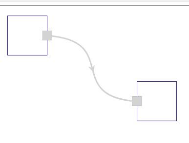

```
jsPlumb.connect({
  source: 'item_left',
  target: 'item_right',
  paintStyle: { stroke: 'lightgray', strokeWidth: 3 },
  endpointStyle: { fill: 'lightgray', outlineStroke: 'darkgray', outlineWidth: 2 },
  overlays: [ ['Arrow', { width: 12, length: 12, location: 0.5 }] ]
}, common)
```

## 2.7. 增加一个端点

demo: https://wdd.js.org/jsplumb-chinese-tutorial/demos/07.html

addEndpoint方法可以用来增加端点，[具体使用请看](https://jsplumbtoolkit.com/community/apidocs/classes/jsPlumbInstance.html#method_addEndpoint)

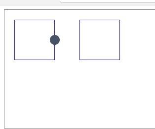

```
    jsPlumb.ready(function () {
      jsPlumb.addEndpoint('item_left', {
        anchors: ['Right']
      })
    })
```

## 2.8. 拖动创建连接

demo: https://wdd.js.org/jsplumb-chinese-tutorial/demos/08.html

如果你将`isSource`和`isTarget`设置成true，那么久可以用户在拖动时，自动创建连接。

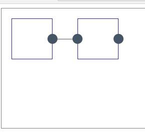

```
jsPlumb.ready(function () {
      jsPlumb.setContainer('diagramContainer')

      var common = {
        isSource: true,
        isTarget: true,
        connector: ['Straight']
      }

      jsPlumb.addEndpoint('item_left', {
        anchors: ['Right']
      }, common)

      jsPlumb.addEndpoint('item_right', {
        anchor: 'Left'
      }, common)

      jsPlumb.addEndpoint('item_right', {
        anchor: 'Right'
      }, common)
    })
```

`一般来说拖动创建的连接，可以再次拖动，让连接断开。如果不想触发这种行为，可以设置。`

```js
  jsPlumb.importDefaults({
    ConnectionsDetachable: false
  })
```

`如果你需要在连接被拖动建立后，更新数据模型，则需要订阅connection事件`, 回调函数的info对象里，有你所需的任何数据。比如说从哪个节点拖动到哪个节点的。

关于事件，可以参考事件章节。

```js
jsPlumb.bind("connection", function(info, originalEvent) {
   .. update your model in here, maybe.
});
```

## 2.9. 给端点增加样式

demo: https://wdd.js.org/jsplumb-chinese-tutorial/demos/09.html

通过设置各种 `*Style`来改变连接或者端点的样式。


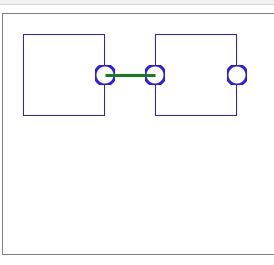

```
jsPlumb.ready(function () {
      jsPlumb.setContainer('diagramContainer')

      var common = {
        isSource: true,
        isTarget: true,
        connector: 'Straight',
        endpoint: 'Dot',
        paintStyle: {
          fill: 'white',
          outlineStroke: 'blue',
          strokeWidth: 3
        },
        hoverPaintStyle: {
          outlineStroke: 'lightblue'
        },
        connectorStyle: {
          outlineStroke: 'green',
          strokeWidth: 1
        },
        connectorHoverStyle: {
          strokeWidth: 2
        }
      }

      jsPlumb.addEndpoint('item_left', {
        anchors: ['Right']
      }, common)

      jsPlumb.addEndpoint('item_right', {
        anchor: 'Left'
      }, common)

      jsPlumb.addEndpoint('item_right', {
        anchor: 'Right'
      }, common)
    })
```

## 2.10. 节点改变尺寸

demo: https://wdd.js.org/jsplumb-chinese-tutorial/demos/10.html

jsplumb实际上不支持改变节点大小，实际上只能通过jquery ui resizable 方法去改变。

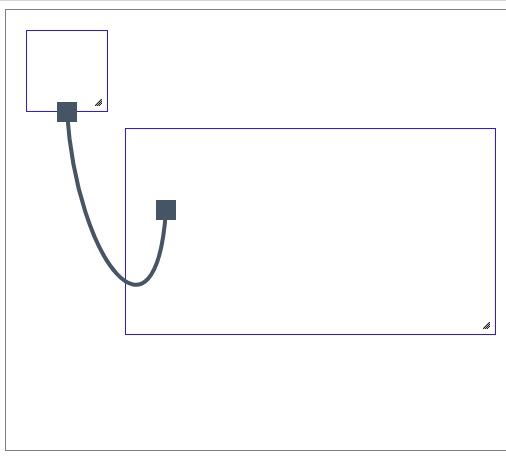

```
<div id="diagramContainer">
    <div id="item_left" class="item"></div>
    <div id="item_right" class="item" style="left:150px;"></div>
  </div>
  <script src="https://code.jquery.com/jquery-1.11.3.js"></script>
  <script src="https://code.jquery.com/ui/1.12.1/jquery-ui.js"></script>
  <script src="./lib/jquery.jsplumb.js"></script>

  <script>
    /* global jsPlumb, $ */
    $('.item').resizable({
      resize: function (event, ui) {
        jsPlumb.repaint(ui.helper)
      }
    })

    jsPlumb.ready(function () {
      jsPlumb.connect({
        source: 'item_left',
        target: 'item_right',
        endpoint: 'Rectangle'
      })

      jsPlumb.draggable('item_left')
      jsPlumb.draggable('item_right')
    })
  </script>
```

## 2.11. 限制节点拖动区域

demo: https://wdd.js.org/jsplumb-chinese-tutorial/demos/11.html

默认情况下，节点可以被拖动到区域外边，如果想只能在区域内拖动，需要设置containment，这样节点只能在固定区域内移动。


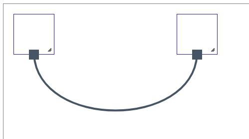

```
jsPlumb.setContainer('area-id')
```

## 2.12. 节点网格对齐

demo: https://wdd.js.org/jsplumb-chinese-tutorial/demos/12.html
网格对齐实际上是设置了`grid`属性，使移动只能按照固定的尺寸移动。然后用一张图作为背景铺开作为网格来实现的。

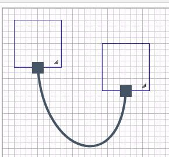

```
#diagramContainer {
  padding: 20px;
  width: 80%;
  height: 400px;
  border: 1px solid gray;
  background-image: url(./images/20180227163310_1bVYeW_grid.jpeg);
  background-repeat: repeat;
}

jsPlumb.draggable('item_left', {
  containment: 'parent',
  grid: [10, 10]
})
```

## 2.13. 给连接添加点击事件：点击删除连线

demo: https://wdd.js.org/jsplumb-chinese-tutorial/demos/13.html

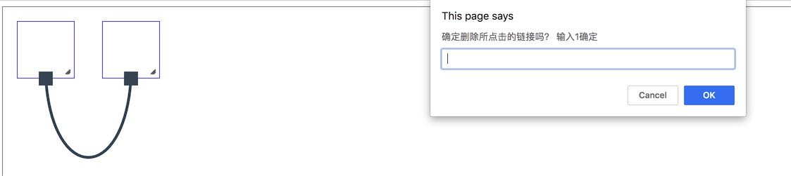

```
// 请单点击一下连接线, 
jsPlumb.bind('click', function (conn, originalEvent) {
  if (window.prompt('确定删除所点击的连接吗？ 输入1确定') === '1') {
    jsPlumb.detach(conn)
  }
})
```

jsPlumb支持许多事件

`jsPlumb Events列表`

- connection
- connectionDetached
- connectionMoved
- click
- dblclick
- endpointClick
- endpointDblClick
- contextmenu
- beforeDrop
- beforeDetach
- zoom
- Connection Events
- Endpoint Events
- Overlay Events
- Unbinding Events

参考用法参考：https://jsplumbtoolkit.com/community/doc/events.html#jsPlumbEvents

## 2.14. 删除节点，包括节点相关的连接

demo: https://wdd.js.org/jsplumb-chinese-tutorial/demos/14.html

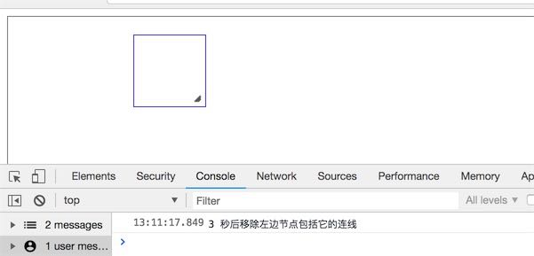

```
// nodeId为节点id, remove方法可以删除节点以及和节点相关的连线
console.log('3 秒后移除左边节点包括它的连线')
setTimeout(function () {
  jsPlumb.remove('item_left')
}, 3000)
```

注意remove方法有些情况下是无法删除干净连线的，[详情](https://jsplumbtoolkit.com/community/doc/removing.html)

## 2.15. 通过编码连接endPoint

demo: https://wdd.js.org/jsplumb-chinese-tutorial/demos/15.html

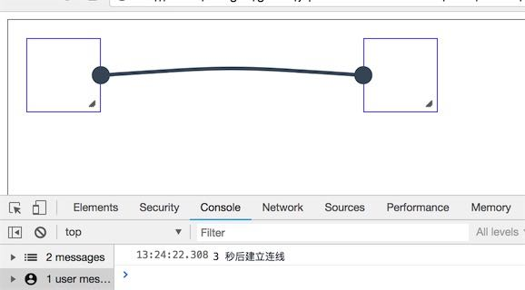

初始化数据后，给节点加上了endPoint, 如果想编码让endPoint连接上。需要在addEndpoint时，就给该断点加上一个uuid, 然后通过connect()方法，将两个断点连接上。建议使用[node-uuid](https://github.com/kelektiv/node-uuid)给每个断点都加上唯一的uuid， 这样以后连接就方便多了。

```
jsPlumb.addEndpoint('item_left', {
  anchors: ['Right'],
  uuid: 'fromId'
})

jsPlumb.addEndpoint('item_right', {
  anchors: ['Left'],
  uuid: 'toId'
})

console.log('3 秒后建立连线')
setTimeout(function () {
  jsPlumb.connect({ uuids: ['fromId', 'toId'] })
}, 3000)
```

## 2.16. 连接前的检查，判断是否建立连接

demo: https://wdd.js.org/jsplumb-chinese-tutorial/demos/16.html

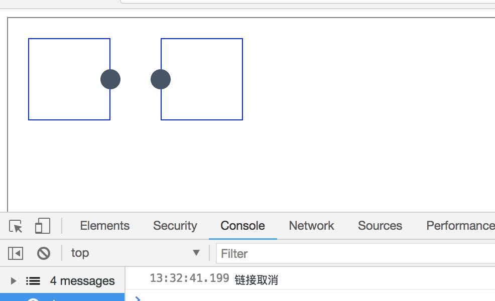

有时候当用户从A端点连接到B端点时，需要做一些检查，如果不符合条件，就不让连接建立。

```
// 当连接建立前
jsPlumb.bind('beforeDrop', function (info) {
  var a = 10
  var b = 2
  if (a < b) {
    console.log('连接会自动建立')
    return true // 连接会自动建立
  } else {
    console.log('连接取消')
    return false // 连接不会建立，注意，必须是false
  }
})
```

## 2.17. 一个端点如何拖拽出多条连线

demo https://wdd.js.org/jsplumb-chinese-tutorial/demos/17.html

默认情况下，`maxConnections`的值是1，也就是一个端点最多只能拉出一条连线。

你也可以设置成其他值，例如5，表示最多可以有5条连线。

如果你想不限制连线的数量，那么可以将该值设置为`-1`

```
var common = {
  isSource: true,
  isTarget: true,
  connector: ['Straight'],
  maxConnections: -1
}

jsPlumb.addEndpoint('item_left', {
  anchors: ['Right']
}, common)
```

## 2.18. 整个节点作为source或者target

demo: https://wdd.js.org/jsplumb-chinese-tutorial/demos/18.html

整个节点作为source或者target， 并且将锚点设置成Continuous，那么锚点就会随着节点的位置改变而改变自己的位置。

jsPlumb的锚点分为四类

- `Static` 静态 固定位置的锚点
- `Dynamic` jsPlumb自动选择合适的锚点，动态锚点
- `Perimeter` 边缘锚点，会根据节点形状去改变位置
- `Continuous` 根据节点位置，自动调整位置的锚点

详情：https://jsplumbtoolkit.com/community/doc/anchors.html

```
    window.jsPlumb.ready(function () {
      var jsPlumb = window.jsPlumb

      jsPlumb.makeSource('A', {
        endpoint:"Dot",
        anchor: "Continuous"
      })

      jsPlumb.makeTarget('B', {
        endpoint:"Dot",
        anchor: "Continuous"
      })

      jsPlumb.draggable('A')
      jsPlumb.draggable('B')
    })
```

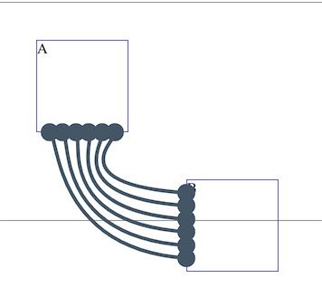

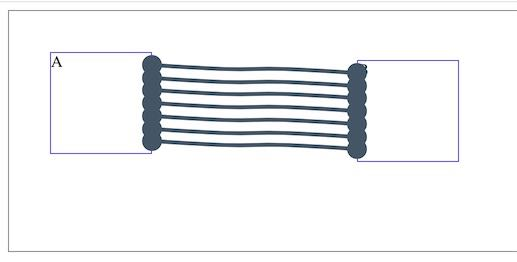

## 2.19. 节点缩放

demo: https://wdd.js.org/jsplumb-chinese-tutorial/demos/19.html

```
 window.jsPlumb.ready(function () {
      var jsPlumb = window.jsPlumb
      jsPlumb.setContainer("diagramContainer")

      jsPlumb.connect({
        source: 'A',
        target: 'B',
        endpoint: 'Dot'
      })
      
      var baseZoom = 1
      setInterval(() => {
        baseZoom -= 0.1
        if (baseZoom < 0.5) {
          baseZoom = 1
        }
        zoom(baseZoom)
      }, 1000)
    })

    function zoom (scale) {
      $("#diagramContainer").css({
          "-webkit-transform": `scale(${scale})`,
          "-moz-transform": `scale(${scale})`,
          "-ms-transform": `scale(${scale})`,
          "-o-transform": `scale(${scale})`,
          "transform": `scale(${scale})`
      })
      jsPlumb.setZoom(0.75);
    }
```

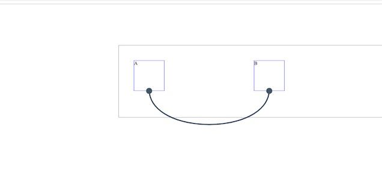

# 3. jsPlumb事件列表

## 3.1. 常用事件

具体事件中回调函数中参数的字段含义，参见
绑定事件的方式, 以connection事件为例子

```js
jsPlumb.bind("connection", function(info) {
   .. update your model in here, maybe.
});
```


### 3.1.1. connection 连接建立时触发

`connection(info, originalEvent)`

- info.connection
- info.sourceId
- info.targetId
- info.source
- info.target
- info.sourceEndpoint
- info.targetEndpoint
- originalEvent: 原始事件。只有用户拖动创建的连接，originalEvent才存在。

**注意事项**：通过编码连接节点，也会触发connection事件，如果只想处理用户拖动创建建立的连接，可以判断第二个参数originalEvent是否存在。

### 3.1.2. connectionDetached 连接断开时触发

`connectionDetached(info, originalEvent)`

- info.connection
- info.sourceId
- info.targetId
- info.source
- info.target
- info.sourceEndpoint
- info.targetEndpoint
- originalEvent

**注意事项**：当拖动一个连线出现后，却没有连接到目标端点就放弃时，不会触发connectionDetached事件，会触发connectionAborted事件

### 3.1.3. connectionMoved 连接移动事件 
`connectionMoved(info, originalEvent)`
### 3.1.4. connectionAborted 连接取消事件 
`connectionAborted(connection, originalEvent)`
### 3.1.5. click 连接点击事件 
`click(connection, originalEvent)`
### 3.1.6. dblclick 连接双击事件 
`dblclick(connection, originalEvent)`
### 3.1.7. connectionDrag 连接拖动事件 
`connectionDrag(connection)`
### 3.1.8. connectionDragStop 连接停止拖动事件 
`connectionDragStop(connection)`
### 3.1.9. endpointClick 端点单击事件 
`endpointClick(endpoint, originalEvent)`
### 3.1.10. endpointDblClick 端点双击事件 
`endpointDblClick(endpoint, originalEvent)`
### 3.1.11. contextmenu 鼠标右键事件 
`contextmenu(component, originalEvent)`
### 3.1.12. beforeDrop 连接建立前事件 
`beforeDrop(info)` 注意如果这个回调函数返回false, 那么连接将不会被建立，可以用来连接建立的拦截
### 3.1.13. beforeDetach 连接断开前事件 
`beforeDetach(connection)`
### 3.1.14. zoom 缩放事件 
`zoom(value)`

## 3.2. 其他事件
### 3.2.1. Connection Events

在获得一个连接后，可以单独给某个连接绑定事件

```js
var connection = jsPlumb.connect({source:"d1", target:"d2"});
connection.bind("click", function(conn) {
    console.log("you clicked on ", conn);
});
```

当获取到连接后，连接还可以绑定其他事件

- click(connection, originalEvent) - notification a Connection was clicked.
- dblclick(connection, originalEvent) - notification a Connection was double-clicked.
- contextmenu(connection, originalEvent) - a right-click on the Connection.
- mouseover(connection, originalEvent) - notification the mouse is over the Connection's path.
- mouseout(connection, originalEvent) - notification the mouse has exited the Connection's path.
- mousedown(connection, originalEvent) - notification the mouse button was pressed on the Connection's path.
- mouseup(connection, originalEvent) - notification the mouse button was released on the Connection's path.

### 3.2.2. Endpoint Events

```js
var endpoint = jsPlumb.addEndpoint("d1", { someOptions } );
endpoint.bind("click", function(endpoint) {
    console.log("you clicked on ", endpoint);
});
```

- click(endpoint, originalEvent) - notification an Endpoint was clicked.
- dblclick(endpoint, originalEvent) - notification an Endpoint was double-clicked.
- contextmenu(endpoint, originalEvent) - a right-click on the Endpoint.
- mouseover(endpoint, originalEvent) - notification the mouse is over the Endpoint.
- mouseout(endpoint, originalEvent) - notification the mouse has exited the Endpoint.
- mousedown(endpoint, originalEvent) - notification the mouse button was pressed on the Endpoint.
- mouseup(endpoint, originalEvent) - notification the mouse button was released on the Endpoint.
- maxConnections(info, originalEvent) - notification the user tried to drop a Connection on an Endpoint that already has the maximum number of Connections. info is an object literal containing these values:
  - info.endpoint : Endpoint on which the Connection was dropped
  - info.connection : The Connection the user tried to drop
  - info.maxConnections : The value of maxConnections for the Endpoint

### 3.2.3. Overlay Events

可以把Overlay理解为连线上的文字或者图标，可以给这些overlays单独绑定事件。

```
jsPlumb.connect({
    source:"el1",
    target:"el2",
    overlays:[
      [ "Label", {
        events:{
          click:function(labelOverlay, originalEvent) { 
            console.log("click on label overlay for :" + labelOverlay.component); 
          }
        }
      }],
      [ "Diamond", {
        events:{
          dblclick:function(diamondOverlay, originalEvent) { 
            console.log("double click on diamond overlay for : " + diamondOverlay.component); 
          }
        }
      }]    
    ]
  });
```


# 4. jsPlumb默认配置简介

参考地址: https://jsplumbtoolkit.com/community/doc/defaults.html

jsPlumb的配置项有很多，如果你不主动去设置，那么jsPlumb就使用默认的配置。

另外建议你不要修改默认的配置，而是使用自定义的方式。

另外一点要注意，如果你想修改默认配置，那么使用importDefaults方法，并且属性的首字母要大写。如果你用addEndpoint, 并使用类似maxConnections的属性，那么首字母要小写。

参见demo: https://wdd.js.org/jsplumb-chinese-tutorial/demos/17.html   demo上需要你自己手动拖动创建连接。

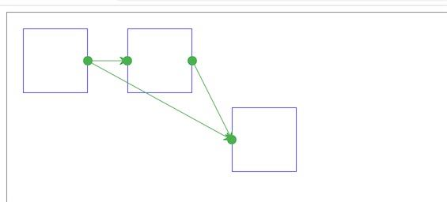

```
var common = {
  isSource: true,
  isTarget: true,
  connector: ['Straight'],
  maxConnections: -1
}

jsPlumb.addEndpoint('item_left', {
  anchors: ['Right']
}, common)
```

```
Anchor : "BottomCenter",
Anchors : [ null, null ],
ConnectionsDetachable   : true,
ConnectionOverlays  : [],
Connector : "Bezier",
Container : null,
DoNotThrowErrors  : false,
DragOptions : { },
DropOptions : { },
Endpoint : "Dot",
Endpoints : [ null, null ],
EndpointOverlays : [ ],
EndpointStyle : { fill : "#456" },
EndpointStyles : [ null, null ],
EndpointHoverStyle : null,
EndpointHoverStyles : [ null, null ],
HoverPaintStyle : null,
LabelStyle : { color : "black" },
LogEnabled : false,
Overlays : [ ],
MaxConnections : 1,
PaintStyle : { strokeWidth : 8, stroke : "#456" },
ReattachConnections : false,
RenderMode : "svg",
Scope : "jsPlumb_DefaultScope"
```

你也可以从`jsPlumb.Defaults`对象中查看默认的配置。如果你想要更加个性化的设置连线，那么最好可以了解一下，它的默认设置有哪些，从而方便的来完成自己的设计需求。

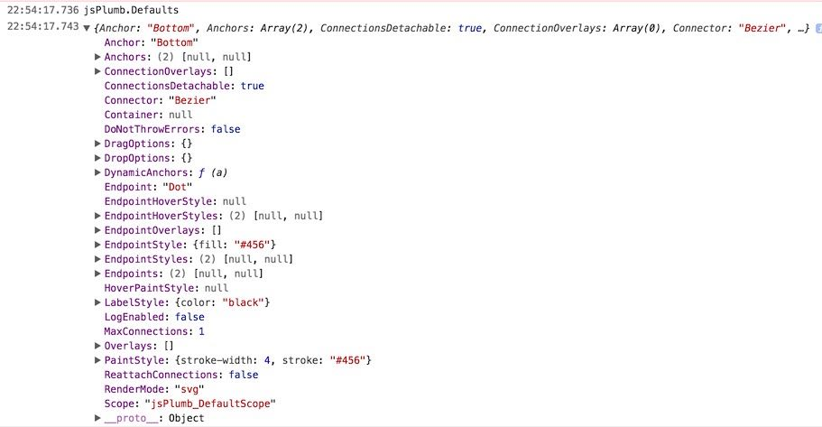


默认参数的简介:

- `Anchor` 锚点，即端点连接的位置
- `Anchors` 多个锚点 [源锚点，目标锚点].
- `Connector` 连接
- `ConnectionsDetachable` 节点是否可以用鼠标拖动使其断开，默认为true。即用鼠标连接上的连线，也可以使用鼠标拖动让其断开。设置成false，可以让其拖动也不会自动断开。
- `Container` 连线的容器
- `DoNotThrowErrors` 是否抛出错误
- `ConnectionOverlays` 连接遮罩层
- `DragOptions` 拖动设置
- `DropOptions` 拖放设置
- `Endpoint` 端点
- `Endpoints` 数组形式的，[源端点，目标端点] 
- `EndpointOverlays` 端点遮罩层
- `EndpointStyle` 端点样式
- `EndpointStyles` [源端点样式，目标端点样式]
- `EndpointHoverStyle` 端点鼠标经过的样式
- `EndpointHoverStyles` [源端点鼠标经过样式，目标端点鼠标经过样式]
- `HoverPaintStyle` 鼠标经过连接线时的样式
- `LabelStyle` 标签样式
- `LogEnabled` 是否启用日志
- `Overlays` 连接线和端点的遮罩层样式
- `MaxConnections` 端点最大连接线数量默认为1， 设置成-1可以表示无数个连接
- `PaintStyle` 连线样式
- `ReattachConnections` 端点是否可以再次重新连接
- `RenderMode` 渲染模式，默认是svg
- `Scope` 作用域，用来区分哪些端点可以连接，作用域相同的可以连接


```
// 可以使用importDefaults，来重写某些默认设置
jsPlumb.importDefaults({
  PaintStyle : {
    strokeWidth:13,
    stroke: 'rgba(200,0,0,0.5)'
  },
  DragOptions : { cursor: "crosshair" },
  Endpoints : [ [ "Dot", { radius:7 } ], [ "Dot", { radius:11 } ] ],
  EndpointStyles : [{ fill:"#225588" }, { fill:"#558822" }]
});
```

# 5. 有没有稍微复杂一点，带有拖放的栗子？
项目地址：https://github.com/wangduanduan/visual-ivr
在线demo: https://wdd.js.org/visual-ivr/

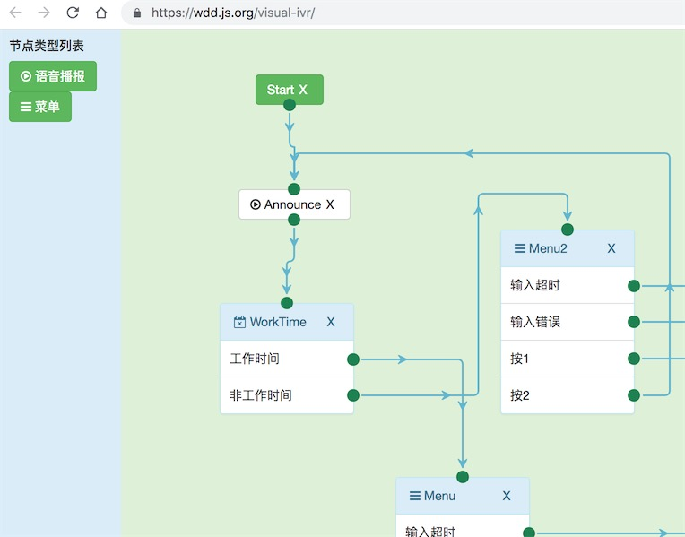

上图是基于jsplumb做的最基础的demo版本。

下图是是最近优化后的版本

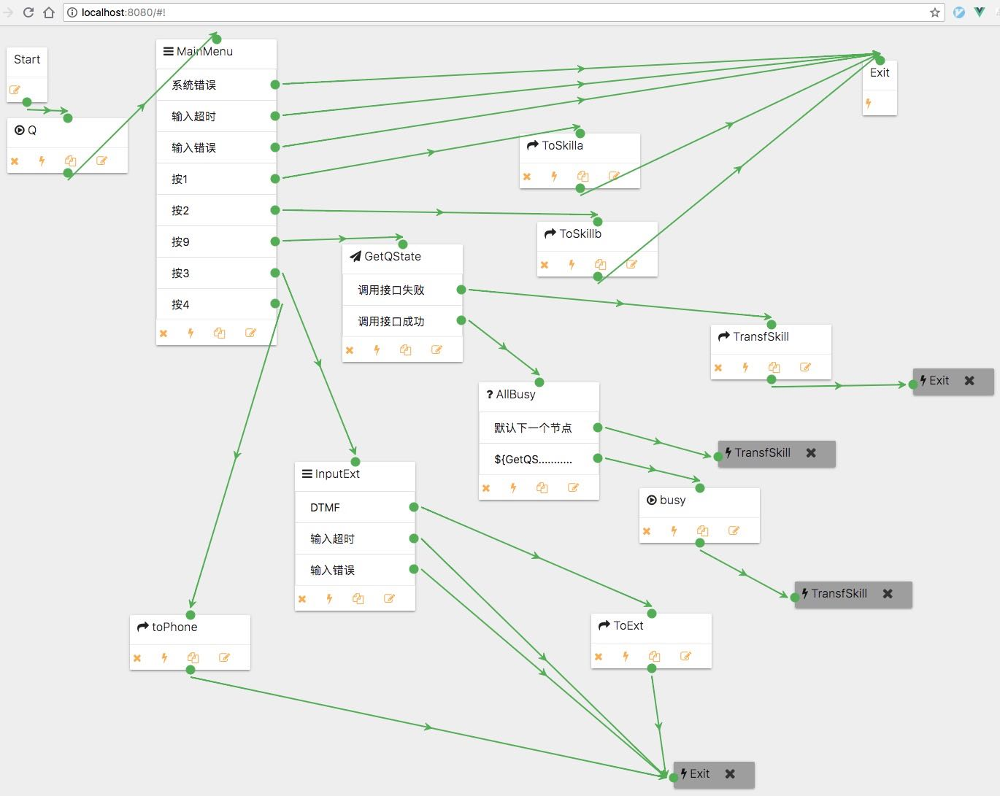

# 6. 还有哪些类似的图形连线可视化项目

## 6.1. G6 AntV 

https://github.com/antvis/g6

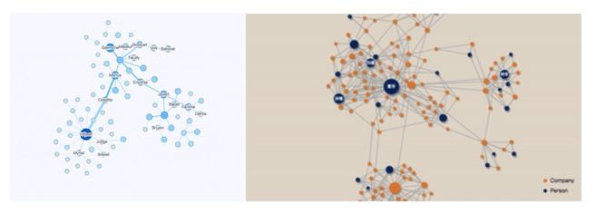

## 6.2. VivaGraphJS 

https://github.com/anvaka/VivaGraphJS

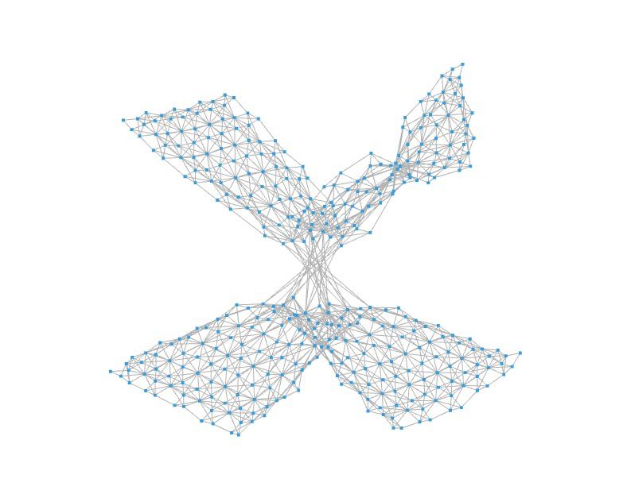

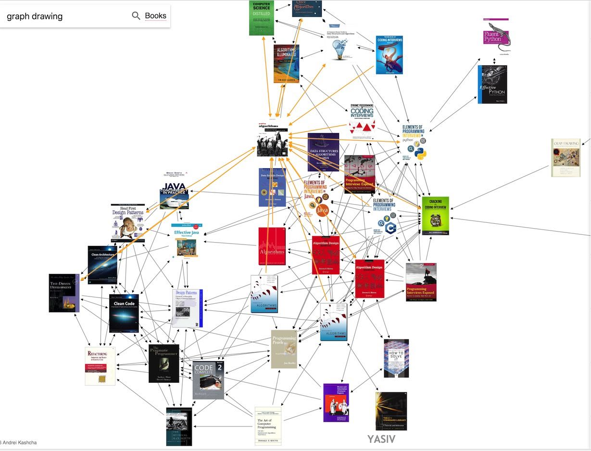

## 6.3. springy 

https://github.com/dhotson/springy

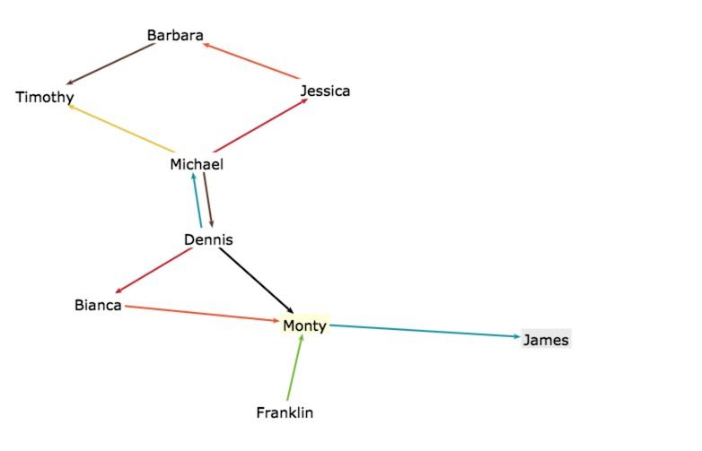

## 6.4. graphviz

https://www.graphviz.org/about/

中文有个基本的介绍文档写的不错，参考：https://casatwy.com/shi-yong-dotyu-yan-he-graphvizhui-tu-fan-yi.html

graphviz可以把你写的.dot文件渲染成一张图。

mac上首先要安装：`brew install graphviz`

然后如果你用vscode的话，vscode上又graphviz的扩展插件，可以预览你的dot文件。

总体来说，graphviz的功能十分强大，同时它也提供了其他语言的脚本api来方便绘图。总之，如果你不想通过拖拉拽来绘制一些流程图，又对图形布局不是很感兴趣的话，`graphviz是一个免费而且效率高而且能装逼的工具`

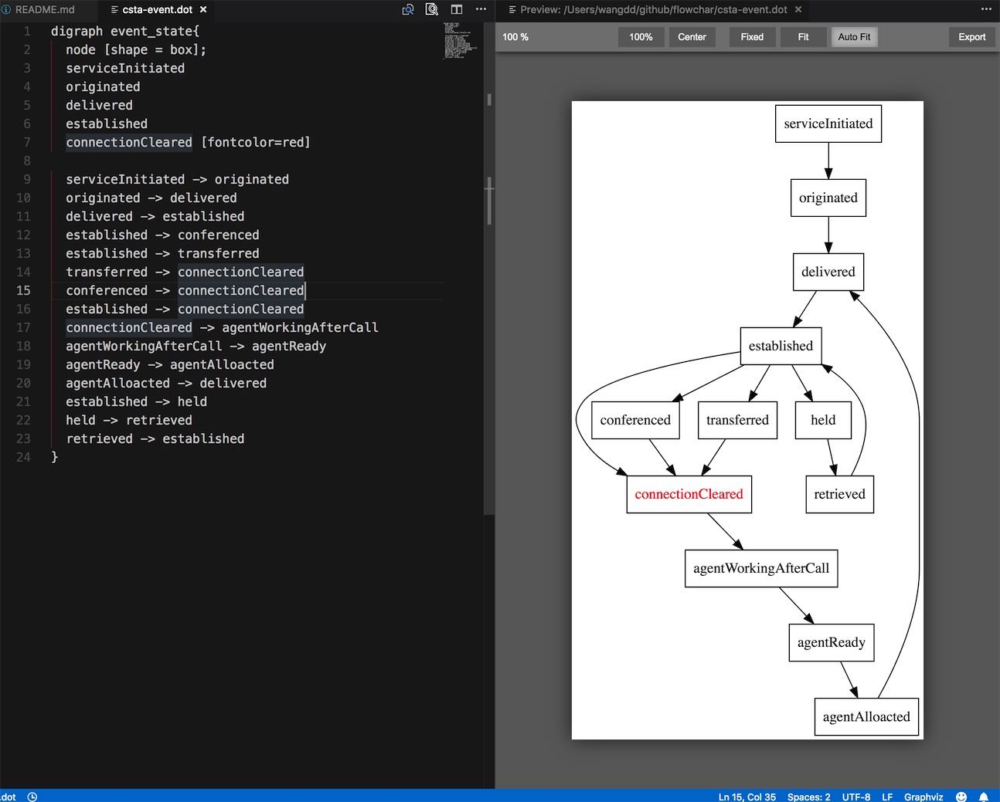

再贴几张graphviz的绘图

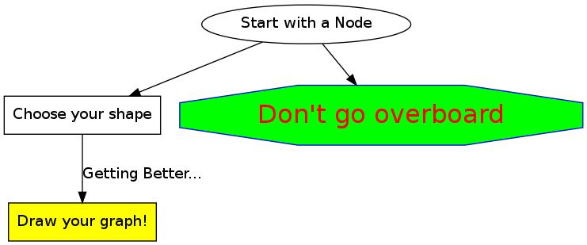

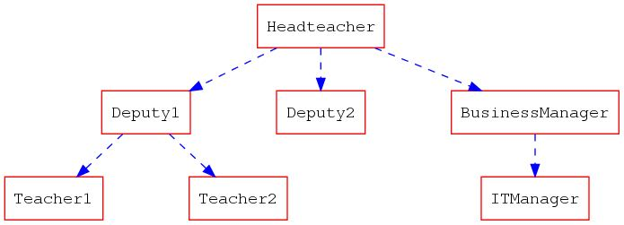

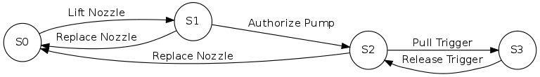

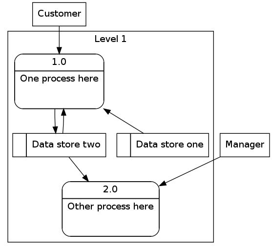


## 6.5. visjs

http://visjs.org/index.html

该项目看起来不错，github上将近有7000 star, 但是它的开发者似乎没时间维护该项目了，正在给该项目找下家。

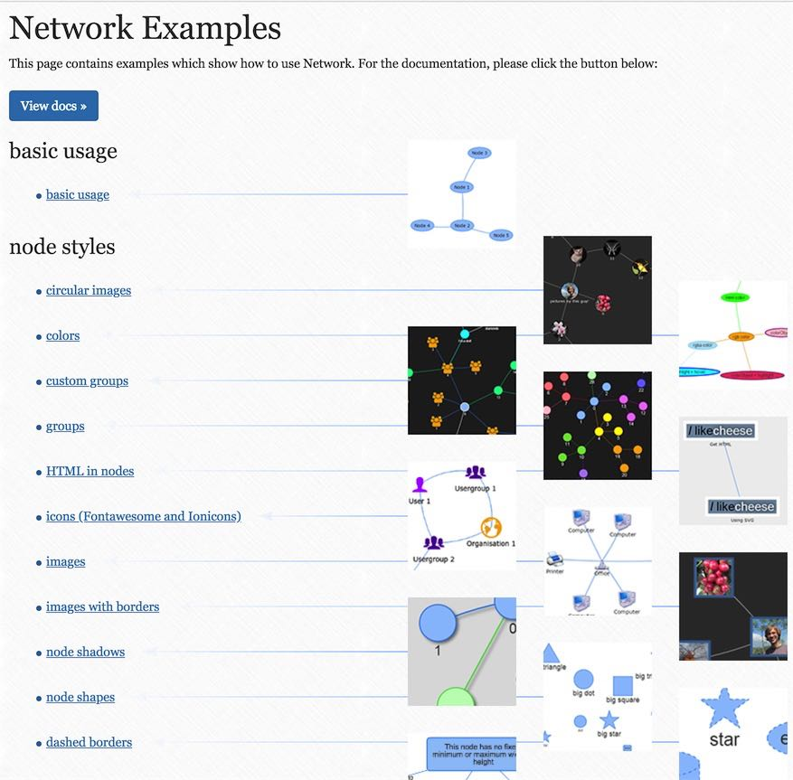


# 7. 参考资源
- [jsPlumb Class](https://jsplumbtoolkit.com/community/apidocs/classes/jsPlumb.html)
- [freedevelopertutorials jsplumb-tutorial](http://www.freedevelopertutorials.com/jsplumb-tutorial/)


